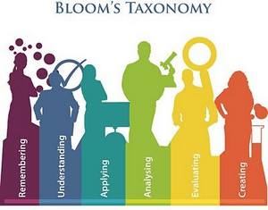

## Course Descriptions

The learning outcomes for the two capstone courses are related, and build on each other largely helping students understand and gain direct experience in the typical lifecycle of restoration projects.

### WATS 5340 - Capstone I

Learning Outcomes include:

1.   Gain direct experience *applying* knowledge as a watershed scientist to working onreal-world aquatic ecosystem **restoration and management problems** (e.g. stream restoration, watershed management,wetland restoration) with practitioners. 
2.   Provide constructively critical *evaluations* of various aspects ofrestoration projects through a mix of **peer-review**of other student projects and *evaluation*of real-world projects.
3.   Build a working *understanding* of the typical **process** through which restoration projects are conceived, proposed, planned, permittedand conceptually designed (see WATS 5350 for the detailed design, constructionbidding, construction implementation and adaptive management aspects ofprojects). 
4.   *Identify *and*document* specific **watershed or ecosystem impairments** inrelationship to pre-defined management objectives.
5.   Objectively *evaluate*and *analyze *the scientific,political, economic and feasibility **tradeoffs of various approaches to restoration** in a specific project context and gainan appreciation of working with diverse stakeholders. *Synthesize* this analysis through a **planning process** that **prioritizes specific restoration and management actions** throughout a watershed.
6.   *Develop *a**vision for a restoration project** and*propose* that solution formally.
7.   *Identify*and *prepare* forms and applications* *to appropriate regulatory agencies fora specific project to gain appreciation of **legaland permitting** aspects of projects.
8.   *Create***conceptual design alternatives** for a specific restoration action.

### WATS 5350 - Capstone II

Learning Outcomes include:

1.  Gain direct experience *applying* knowledge as a watershed scientist to working onreal-world aquatic ecosystem **restoration and management problems** (e.g. stream restoration, watershed management,wetland restoration) with practitioners. 
2.  Provide constructively critical *evaluations* of various aspects ofrestoration projects through a mix of **peer-review**of other student projects and *evaluation*of real-world projects.
3.  Build a working *understanding* of the typical **process**through which restoration projects are conceived, proposed, planned, permittedand conceptually designed (see WATS 5701 for the detailed design, constructionbidding, construction implementation and adaptive management aspects ofprojects). 
4.  Develop a working *understanding* of different aspects and approaches to **restoration design **and *create* two types of design and *evaluate* their ability to achieve project objectives. *Articulate *specific, testable **design hypotheses** for your own designs.
5.  *Develop*a pragmatic **Adaptive Management Plan** for a real project.
6.  Get first-hand experience **constructing & implementing** a ‘cheap and cheerful’ restoration project by *building* structures you *designed*.
7.  Understand the principles of **Post Project Appraisals and Monitoring**and how to evaluate overall restoration objectives and test design hypotheses. 
8.  *Apply* the evaluation and adjust loops of an **Adaptive Management Plan **to see how the process of learning-by-doing can work.