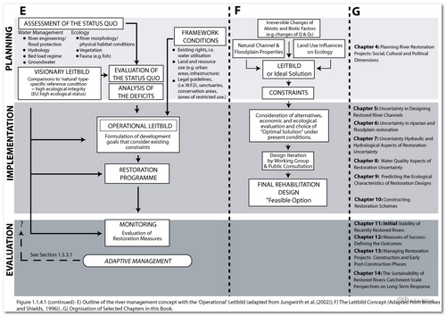

## Background

### Synopsis of Topic

On Friday, we will meet in class for an hour and then head to the Logan River at Rendezvous Dog Park. We will be out until 5p.

In class, we will first discuss different approaches to restoration planning. Basically, most approaches have similar elements, but the organization and wording varies, We will then specifically consider the Conservation Action Planning process developed by the Nature Conservancy. This process was used by the Logan River Task Force for general planning for the Logan River between First Dam and Cutler Reservoir. Hence, this provides the backdrop for discussing general goals for the current project at Rendezvous Park and - TA DAH! - the next reach upstream for which you will be developing conceptual design alternative this December.

In the field, we will meet up with (i) Frank Howe (chair of the Logan River Task Force), (ii) Lance Houser (assistant Logan City Engineer), and (iii) Darren Olsen (Principal, Bio-West), who has led the efforts to develop and implement the Logan River CAP. These three are your CLIENTS for your design exercise this fall.

### Why we're covering it

To learn more about the restoration process, by looking at a real restoration project currently in construction and learning from working practitioners about this process. 

### Learning Outcomes

* Build a working *understanding* of the typical **process** through which restoration projects are conceived, proposed, planned, permitted and conceptually designed. 

------
## Resources

### Slides & Handouts

* [Anoucement](https://usu.instructure.com/courses/468472/discussion_topics/1540555)
* Class Slides
* Logan River CAP Table- [`Logan River Conservation Action Plan.xlsx`](https://usu.box.com/s/bavz45cvba1eyg8exg4734hjq1i3epg3) 

### Relevant or Cited Literature

*Conservation Action Planning*
* TNC, 2007. [Conservation Action Planning Handbook: Developing Strategies, Taking Action and Measuring Success at Any Scale](https://usu.box.com/s/ay217s1bjvp41h8szh41m7pv0o75fmg6). The Nature Conservancy, Arlington, VA.
* TNC, 2007. [Conservation Action Planning: Developing Strategies, Taking Action and Measuring Success at Any Sclae: Overview of Basic Practices](https://usu.box.com/s/uv8q54sxt2zgdrhks7wve7bnom5gdwwx). The Nature Conservancy, Arlington, VA.

*Logan River Restoration*
* Logan River Task Force, 2016. [Logan River Restoration Conservation Action Plan](https://usu.box.com/s/g9sow7wmftsmdo1h9rkmm4mbqej32msn). Bio-West, Logan, UT. 15 pp.

### Relevant Links

* [Bio-West](http://www.bio-west.com/) - *Consulting firm here in Logan ([Daren Olsen](http://www.bio-west.com/personnel/darren-olsen/))*
* [Allred Restoration](http://www.allred-restoration.com/) - *Consulting firm here in Logan (Tyler Alred)*
* [City of Logan](http://www.loganutah.org/) - *Client & Lead on Logan River Restoration*

----
← [Previous Topic](1_Course_I_Overview)      &nbsp;&nbsp;&nbsp;          [Next Topic](3_Assessing_Condition) →
